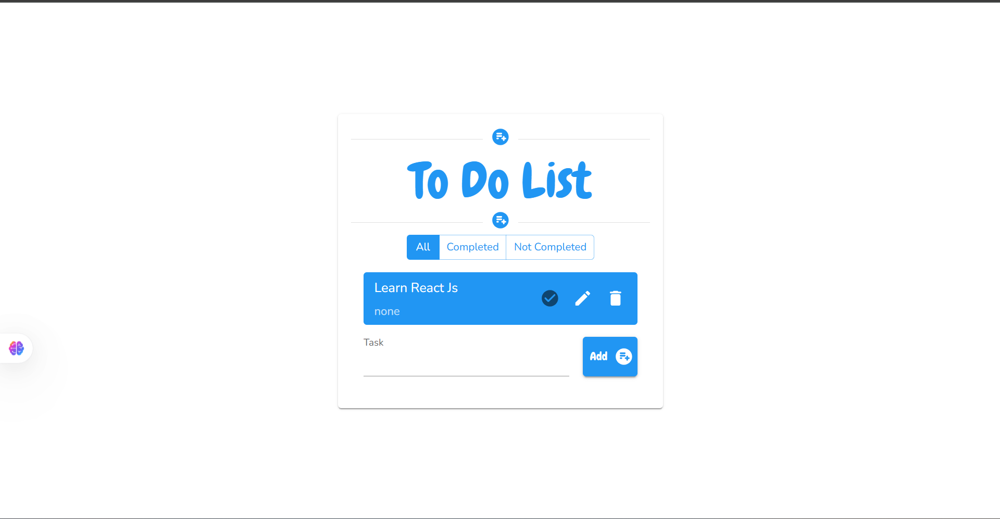

# To-Do List App

A sleek, responsive to-do list built with **React** and powered by **Material-UI** for effortless styling and interactive design.

---

##  Table of Contents

1. [Demo](#demo)
2. [Preview](#preview)
3. [Features](#features)  
4. [Tech Stack](#tech-stack)  
5. [Installation & Setup](#installation--setup)  
6. [Usage](#usage)  
7. [Project Structure](#project-structure)  

---

##  Demo
https://papaya-custard-f3f242.netlify.app/

## 🖼️ Preview



---

##  Features

- Add, edit, complete, and remove tasks with ease  
- Built-in Material-UI components ensure a clean look and feel  
- Responsive layout that cuddles all screen sizes, from phones to desktops  
- Interactive animations and theming for a polished user experience

---

##  Tech Stack

- **React** – Front-end library for building UI  
- **@mui/material** & **@emotion/react**/**@emotion/styled** – Material-UI components and styling  
- **JavaScript (ES6+)**, **HTML5**, **CSS3** – Core web technologies  
- **Optional Extras**:  
  - **PropTypes** – For type-checking props  
  - **React Router** – For future routing needs  
  - **LocalStorage** – To persist your list between sessions

---

##  Installation & Setup

```bash
git clone https://github.com/kebasfaycel/to-do-list.git
cd to-do-list
npm install
npm start
```

## Project Structure

```bash
to-do-list/
├── public/
├── src/
│   ├── components/       # Reusable UI pieces (e.g., TaskItem, TaskList)
│   ├── App.js            # App root with routing (if any)
│   ├── index.js          # Entry point
│   └── styles/           # Custom styles or theme overrides
├── .gitignore
├── package.json
└── README.md

